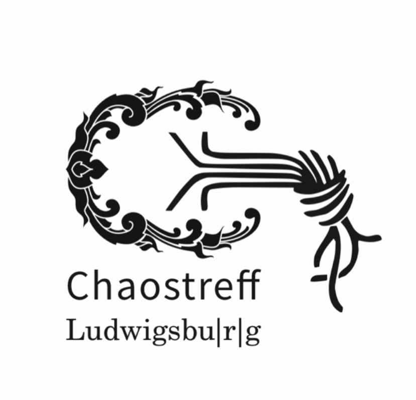

#### Um was gehts?
Der Chaostreff Ludwigsburg ist ein lockeres Zusammentreffen von Hackern, die sich dem CCC nahefühlen.

#### Wann und Wo trefft ihr euch?

Der nächste RL-Termin steht auf Grund von Covid-19 noch nicht fest. Aktuell trifft man uns auf https://matrix.complb.de
(#chaostreff:matrix.complb.de) und jeden Mittwoch per Jitsi (https://complb.de/covid1920200315/)

Du erreichst uns außerdem per Mail über chaostreff AT complb PUNKt de

Im Rahmen des Chaostreffs gibt es auch immer wieder Kurzvorträge, mehr Infos dazu unter https://complb.de/vas
